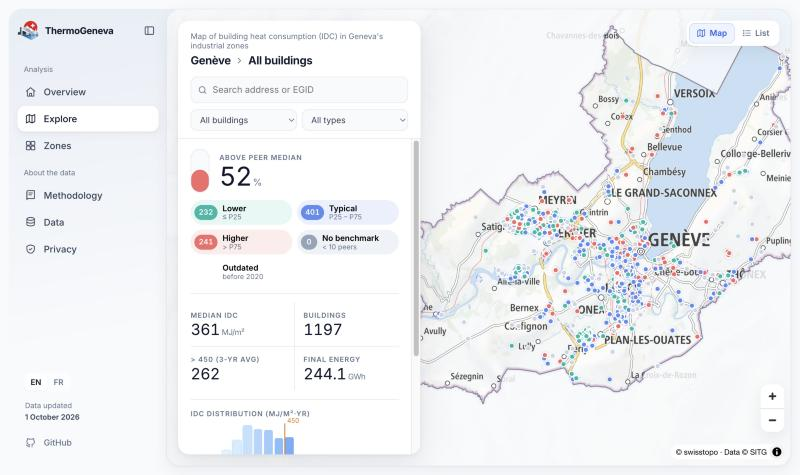
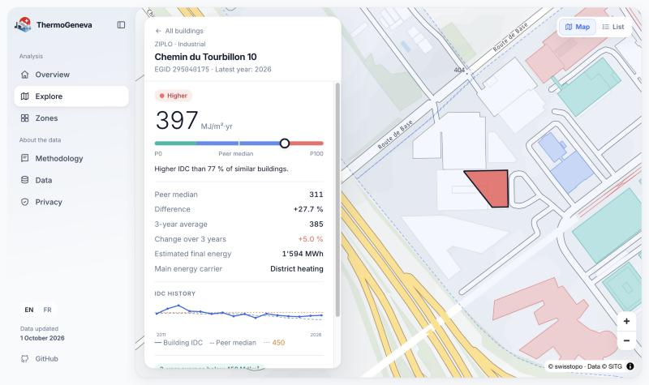
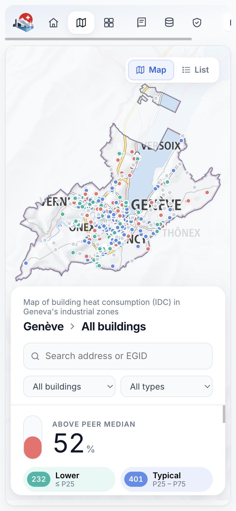
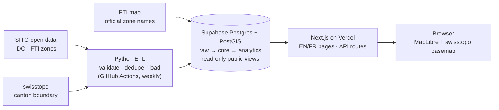

<p align="center">
  
</p>

<h1 align="center">ThermoGeneva</h1>

<p align="center">
  <strong>Heat-consumption benchmark for the industrial buildings of Geneva, built on official open data.</strong><br/>
  <a href="https://thermogeneva.ch">thermogeneva.ch</a> · English / Français
</p>

---

ThermoGeneva takes the official **heat consumption index (IDC)** that every heated building in the Canton of Geneva declares each year. For each industrial or logistics building, it answers three questions:

1. **How does it compare with similar buildings?** It is placed against buildings of the same type across the canton.
2. **Is it improving or getting worse?** It shows the 3-year trend.
3. **How close is it to Geneva's legal thresholds?** These are the 450 MJ/m² improvement threshold and the "significant consumer" thresholds of 800, 650 and 550.

The site covers every building in the FTI industrial zones, plus every industrial and logistics building elsewhere in the canton.

| | |
|---|---|
| **1,197** buildings | 874 with up-to-date data, 323 flagged as outdated |
| **60** industrial-zone polygons | 58 matched to the official FTI zone names (ZIMEYSA, ZIPLO, PAV…) |
| **Weekly** automatic refresh | from the SITG and swisstopo open-data services |
| **2** languages | English and French, with SEO metadata and structured data |

<p align="center">
  
</p>

<table>
  <tr>
    <td width="62%"></td>
    <td width="38%"></td>
  </tr>
  <tr>
    <td><sub>Building card: IDC, position among similar buildings, trend, history and legal threshold.</sub></td>
    <td><sub>Mobile layout.</sub></td>
  </tr>
</table>

## How the benchmark works

| Step | Rule |
|---|---|
| **Peer group** | Same building type (industry, logistics, offices, retail…) across the whole canton, same year. A benchmark is only shown when there are **at least 10 peers**. |
| **Position** | Percentile rank within the peer group. ≤ P25 is *Lower*, P25–P75 is *Typical*, > P75 is *Higher*. |
| **Zone comparison** | Zone median, only when the zone has at least 10 buildings with data that year. |
| **Trend** | Latest IDC compared with the IDC three years earlier. |
| **Final energy** | IDC × heated floor area (SRE) ÷ 3,600, in MWh. |
| **Legal thresholds** | Applied to the **3-year average**: 450 MJ/m² (improvement measures), and the "significant" thresholds of 800 until 2026, 650 from 2027 and 550 from 2031. |
| **Outdated data** | A building whose last declaration is more than 6 years old is still shown, in grey, but it is excluded from every statistic and median. |

> ThermoGeneva is an indicative reading of published data. It is **not an energy audit**, and only the cantonal energy office (OCEN) determines legal obligations.

## Architecture



- **ETL (`etl/`):** paged download from the SITG ArcGIS REST services, with a schema-drift check. Only an allow-list of fields is imported: no owner, occupant or respondent fields ever enter the database. Records are cleaned (invalid years, missing EGIDs, duplicates) and loaded in a single transaction. Each building is assigned to a zone by largest overlap (≥ 50 %) or by its point-on-surface.
- **Data-quality guard (`etl/checks.py`):** before loading, each weekly download is compared with the last successful load: row and building counts, FTI zones, latest year, share of empty IDC/SRE values, buildings without geometry and rejected rows. After the benchmarks are recalculated (still inside the transaction) the number of buildings shown on the site is checked again. If anything is out of tolerance the load is rolled back, the site keeps last week's data and the GitHub Actions run fails, which sends an e-mail alert. The checks are covered by unit tests (`tests/`) that run before every refresh.
- **Database (`sql/migrations/`):** PostGIS in EPSG:2056, with materialized views for the benchmarks and zone metrics. The public API is a set of read-only views behind row-level security. The browser never talks to the database directly; only the Next.js server does.
- **Web (`web/`):**
  - **Stack:** Next.js 16 (App Router) with next-intl for EN/FR and MapLibre GL on the swisstopo light basemap.
  - **SEO:** canonical and hreflang tags, JSON-LD (Dataset, FAQPage, Place…), a sitemap and `llms.txt`.
  - **Security headers:** a strict Content-Security-Policy, HSTS and frame-ancestors `none`.
- **Automation:** a GitHub Actions workflow refreshes the data every Monday, and Dependabot keeps dependencies up to date.

## Repository structure

```
etl/              Python ETL (fetch → transform → quality checks → load)
tests/            unit tests for the data-quality checks
sql/migrations/   Database schema, benchmarks and public API, in order (001–011)
web/              Next.js website (EN/FR)
.github/          Weekly data refresh workflow, Dependabot
docs/             Screenshots for this README
```

## Running it locally

**Data pipeline:** needs Python 3.12+ and a Supabase/PostGIS database with the migrations in `sql/migrations/` applied in order.

```bash
python -m venv .venv && source .venv/bin/activate
pip install -r requirements.txt
cp .env.example .env          # then set SUPABASE_DB_URL (never commit it)
python -m etl.run --dry-run   # download and validate only
python -m etl.run             # full load + benchmark refresh
python -m etl.run --force     # load even if a quality check fails (after checking the change is real)
python -m unittest discover -s tests   # quality-check tests
```

**Website:** needs Node 24.

```bash
cd web
npm install
# web/.env.local
#   NEXT_PUBLIC_SUPABASE_URL=...
#   NEXT_PUBLIC_SUPABASE_PUBLISHABLE_KEY=...   (publishable key only, never the service-role key)
#   NEXT_PUBLIC_SITE_URL=http://localhost:3000
npm run dev
```

## Data sources and credits

- **IDC (heat consumption index):** SITG / OCEN, dataset *SCANE_INDICE_MOYENNES_3_ANS*. © SITG, open data, [terms of use](https://sitg.ge.ch/ressources/conditions-utilisation-donnees).
- **Industrial zone perimeters:** SITG / FTI, *FTI_PERIMETRE*.
- **Official zone names:** [FTI – Fondation pour les terrains industriels de Genève](https://www.ftige.ch/ecoparcs/).
- **Canton boundary and basemap:** © [swisstopo](https://www.swisstopo.admin.ch/).
- **Legal thresholds:** [État de Genève – IDC](https://www.ge.ch/connaitre-consommation-energie-batiment-idc/proprietaires-immeubles).

The site needs no account and collects no personal data from its visitors.

## Built with AI

This project was built with the help of AI.

- **My work:** the metrics and the data cleaning. I defined how buildings are compared, which thresholds apply and how invalid, duplicate or outdated records are handled.
- **[Claude](https://www.anthropic.com/claude) (Anthropic's AI assistant):** all of the website's code.

## Author

**Ciro Scognamiglio**, [thermogeneva.ch](https://thermogeneva.ch)
